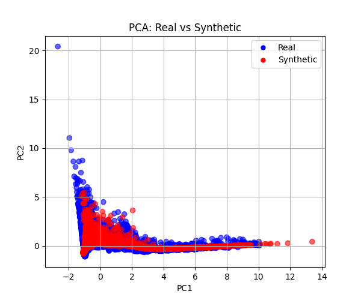
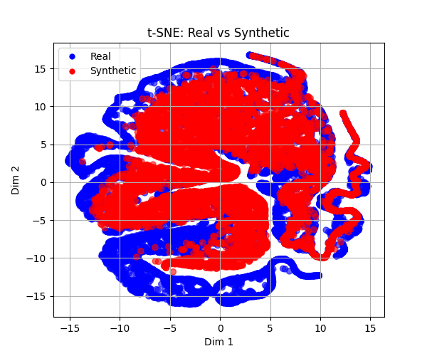

# 📊 Synthetic Stock Data Generator using VAE and WGAN

This project demonstrates the generation of **synthetic Apple stock price data** using two deep generative models:

- **Variational Autoencoder (VAE)**
- **Wasserstein GAN (WGAN)**

These models simulate realistic financial time-series data where real datasets may be limited, private, or expensive to obtain.

---

## 🧠 Project Summary

- **Models Used**: VAE (TensorFlow) and WGAN (Keras)
- **Dataset**: Apple Inc. stock data from 1980–2020
- **Features Used**: `Open`, `High`, `Low`, `Close`, `Volume`
- **Techniques**:
  - StandardScaler & MinMaxScaler
  - Visual evaluation using PCA and t-SNE
- **Outputs**:
  - `synthetic_AAPL.csv` (from VAE)
  - WGAN plots (saved as images)

---

## 📂 Folder Structure

| Folder/File                     | Description                                      |
|--------------------------------|--------------------------------------------------|
| `src/train_vae.py`             | VAE model training and generation script         |
| `src/train_wgan.py`            | WGAN training script (optional to run)           |
| `data/raw/AAPL_stock.csv`      | Raw stock dataset                                |
| `visualizations/`              | PCA and t-SNE plots for real vs synthetic data   |
| `models/`                      | Trained model weights (if saved)                 |
| `README.md`                    | Project documentation                            |
| `requirements.txt`             | Python dependencies                              |

---

## 📈 Visual Results

### VAE: Real vs Synthetic

---

## 🔄 WGAN: Alternative Generative Approach

In addition to the VAE model, a **Wasserstein GAN (WGAN)** was implemented for comparison.

Due to high computational load (2000+ epochs), WGAN outputs were pre-generated and added to this repository as static visualizations.

### WGAN Visual Outputs

#### PCA: Real vs Synthetic

#### t-SNE: Real vs Synthetic

---

## 👨‍💻 Author

- Meet Patel

---

## 📚 References

- [TensorFlow CVAE Tutorial](https://www.tensorflow.org/tutorials/generative/cvae)
- Kingma, D. P., & Welling, M. (2014). *Auto-Encoding Variational Bayes*
- Arjovsky, M., Chintala, S., & Bottou, L. (2017). *Wasserstein GAN*
- Oleh Onyshchak's [Apple Stock Dataset on Kaggle](https://www.kaggle.com/datasets/olegon/usa-stocks-daily)
