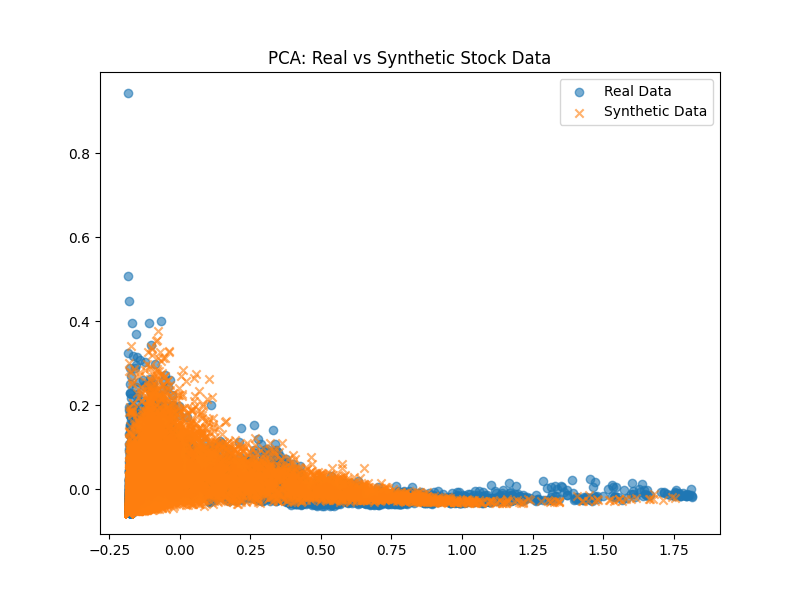
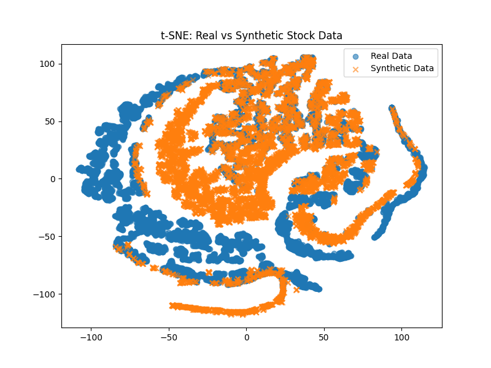

## 🔄 WGAN: Alternative Generative Approach

In addition to the VAE model, this project also includes a **Wasserstein GAN (WGAN)** implementation to generate synthetic Apple stock data.

Due to computational load (2000+ epochs), visual outputs were pre-generated and added to this repository for comparison.

### WGAN Visual Outputs

#### PCA: Real vs Synthetic

#### t-SNE: Real vs Synthetic

